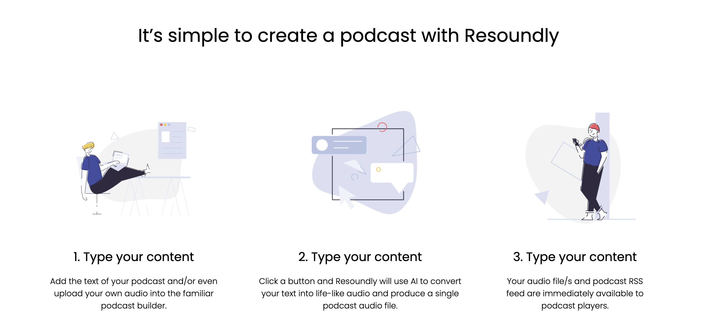

# Resoundly Home page design 

> A landing page of the resoundly website.




## Built With

- HTML
- Tailwind CSS


## Live Demo

[Resoundly ](https://jolly-jackson-bb6310.netlify.app/)


### Setup

1. Clone this repository  
```
git clone git@github.com:Maryjanee/Resoundly.git
```
2. Run `cd Resoundly` to change directory into the project.
3. Run  `npm install` seperately to download the project's dependencies.

4. Run `npm run build-css` to build the styles. 


